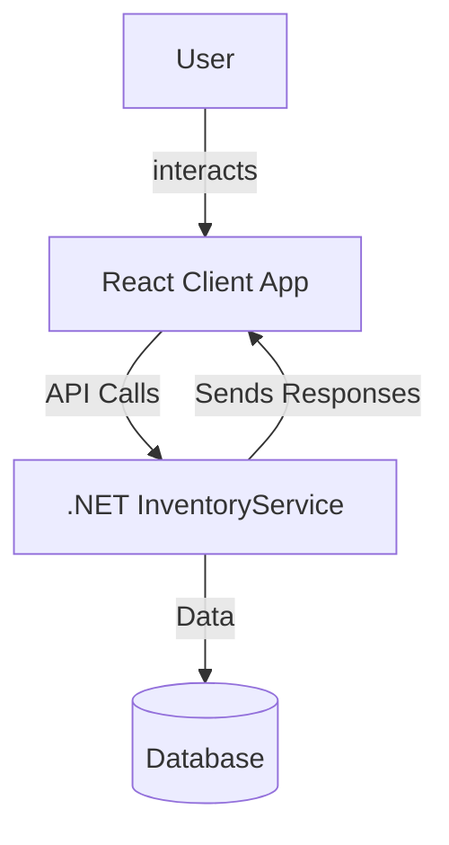
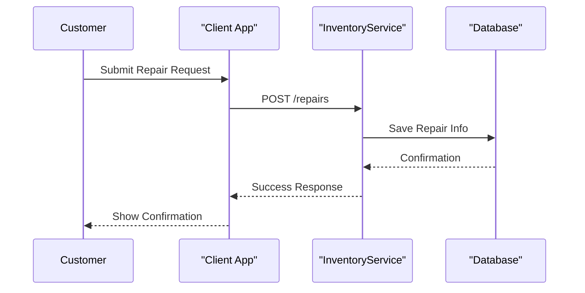

# TechFix Solutions

A multi-component application for managing technical repair operations, inventory, and customer interactions.

## Overview

**TechFix Solutions** aims to streamline repair service management, inventory tracking, and customer handling. It consists of a React-based client and a .NET-based backend service.

---

## Architecture Diagram



---
## Sequence Diagram



---

## Getting Started

### Prerequisites

- Node.js & npm (for client)
- .NET 8.0 SDK (for backend)
- Database (SQL Server or as configured)

### Setup

```bash
# Client setup
cd techfixsolutions-client
npm install
npm start

# Backend setup
cd TechFixSolutions.InventoryService
dotnet build
dotnet run
```


## Project Structure

```
TechFix-Solutions---Overall/
│
├── techfixsolutions-client/      # React frontend
├── TechFixSolutions.InventoryService/  # .NET backend service


